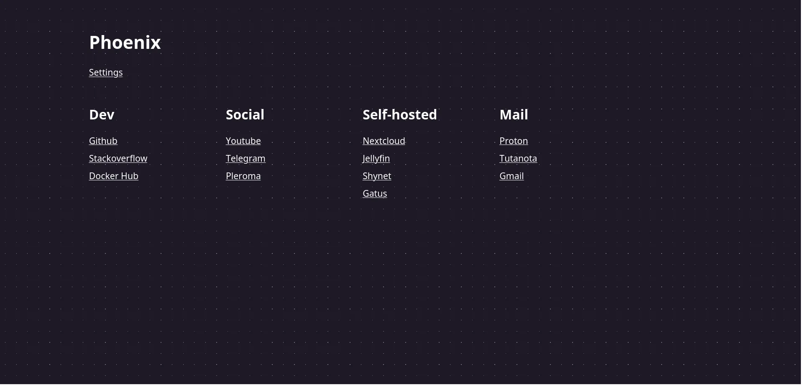

# Phoenix

[](https://goreportcard.com/report/github.com/ordinary-dev/phoenix)



Self-hosted start page without the extra stuff.

## Features
- No javascript
- Relatively low resource consumption (around 7 MiB of RAM)
- Authorization support
  - SSO via Trusted Header Auth (_Reverse Proxy_)
- Font Awesome integration

## Configuration
Service settings can be set through environment variables.

| Variable            | Description                                                      | Default                               |
| ---                 | ---                                                              | ---                                   |
| P_DBPATH            | Path to the sqlite database.                                     | Docker: `/var/lib/phoenix/db.sqlite3` |
| P_SECRETKEY         | A long and random secret string used for authorization.          |                                       |
| P_LOGLEVEL          | Log level settings: `debug`, `info`, `warning`, `error`, `fatal` | `warning`                             |
| P_PRODUCTION        | Is this instance running in production mode?                     | `true`                                |
| P_HEADERAUTH        | Enable Trusted Header Auth (SSO)                                 | `false`                               |
| P_DEFAULTUSERNAME   | Data for the first user.                                         |                                       |
| P_DEFAULTPASSWORD   | Data for the first user.                                         |                                       |
| P_SECURECOOKIE      | Controls the "secure" option for a token cookie.                 | `true`                                |

Appearance settings:
| Variable            | Description                                                      | Default                               |
| ---                 | ---                                                              | ---                                   |
| P_TITLE             | Website title                                                    | `Phoenix`                             |
| P_FONTFAMILY        | The font used on the site. Inserted directly into css.           | `sans-serif`                          |

## Docker-compose example
```yml
services:
  phoenix:
    image: ghcr.io/ordinary-dev/phoenix
    volumes:
      - phoenix:/var/lib/phoenix
    ports:
      - 80:8080
    environment:
      P_SECRETKEY: "your-random-string"
      P_DEFAULTUSERNAME: "admin"
      P_DEFAULTPASSWORD: "super-password"
    restart: unless-stopped

volumes:
  phoenix:
```

## Icons

You can use the free version of [Font Awesome](https://fontawesome.com/search).

The name of the icon must be specified in the following form: `set name/icon name`, for example: `brands/github` or `regular/credit-card`.
