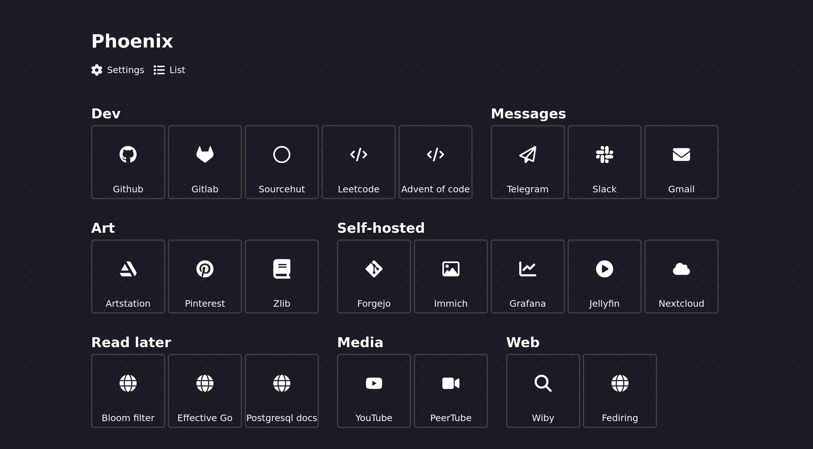

# Phoenix

[](https://goreportcard.com/report/github.com/ordinary-dev/phoenix)

Self-hosted start page without the extra stuff.

List view:


Tile view:


## Features
- No javascript
- Authorization support
  - SSO via Trusted Header Auth (_Reverse Proxy_)
- Font Awesome integration
- Multiple styles
- Export and import

## Configuration

Service settings can be set through environment variables.

| Variable            | Description                                                      | Default                               |
| ---                 | ---                                                              | ---                                   |
| DB_PATH             | Path to the sqlite database.                                     | Docker: `/var/lib/phoenix/db.sqlite3` |
| LOG_LEVEL           | Log level settings: `debug`, `info`, `warning`, `error`          | `warning`                             |
| HEADER_AUTH         | Enable Trusted Header Auth (SSO)                                 | `false`                               |
| DEFAULT_USERNAME    | Data for the first user.                                         |                                       |
| DEFAULT_PASSWORD    | Data for the first user.                                         |                                       |
| ENABLE_REGISTRATION | Allow registration via web interface?                            | `true`                                |
| SECURE_COOKIE       | Controls the "secure" option for a token cookie.                 | `true`                                |

HTTP server settings:

| Variable          | Description                                                                                 | Default       |
| ---               | ---                                                                                         | ---           |
| SOCKET_PATH       | Unix socket path.                                                                           |               |
| LISTENING_ADDRESS | Listening address, for example: `:80` or `127.0.0.1:8080`. Ignored if `SOCKET_PATH` is set. | `:8080`       |

Appearance settings:

| Variable          | Description                                                      | Default                               |
| ---               | ---                                                              | ---                                   |
| TITLE             | Website title                                                    | `Phoenix`                             |
| FONT_FAMILY       | The font used on the site. Inserted directly into css.           | `sans-serif`                          |

## Docker-compose example
```yml
services:
  phoenix:
    image: ghcr.io/ordinary-dev/phoenix
    volumes:
      - phoenix:/var/lib/phoenix
    ports:
      - 80:8080
    restart: unless-stopped

volumes:
  phoenix:
```

## Icons

You can use the free version of [Font Awesome](https://fontawesome.com/search).

The name of the icon must be specified in the following form: `set name/icon name`, for example: `brands/github` or `regular/credit-card`.
